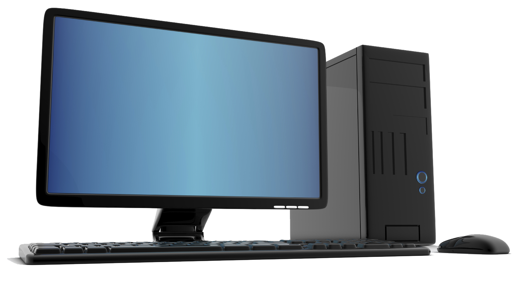
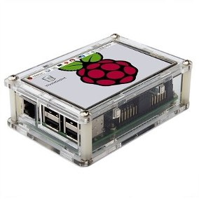
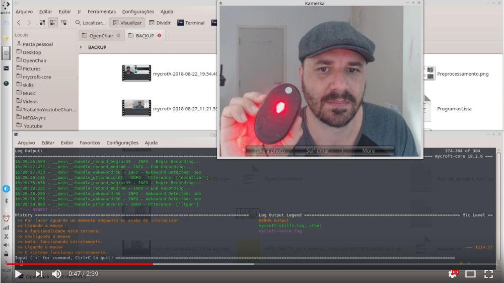

# 

Este projeto é uma cadeira de rodas estilo a utilizada pelo famoso fisico Stephen Hawking. De código aberto, esta cadeira funciona por meio de movimentos faciais e comando de voz. Pode ser instalado - por pessoas leigas - em um notebook ou PC e alguns componentes eletrônicos.  

This design is a wheelchair style used by famous physicist Stephen Hawking. Open source, this chair works by means of facial movements and voice command. It can be installed by lay people on a notebook or PC and some electronic components.

## Objetivo Geral

O objetivo principal do projeto é desenvolver uma cadeira de rodas gerenciada por uma assistente virtual, responsável pela interface-homem-maquina e que deverá acionar a cadeira por voz ou movimentos faciais. Quase todo o projeto deverá ser de código aberto. Este projetó contará com o apoio da Universidade de São Paulo, que deverá disponibilizar um protótipo dentro de aproximadamente 1 ano.

Na pasta "Notebook_PC_OS' está armazenado a imagens do Sistema operacional em formato de LiveDVD ou LiveUSB. Esta imagens podem ser instaladas en notebook e computadores pessoais comuns. Dentro da pasta também está toda a documentação necessária para que qualquer pessoa comum possa fazer a instalação por conta própria.

Na pasta "RaspberryPi_OS" está a imagem para rodar em Raspberry Pi Model B, como alternativa de configuração e redução de custo.

## Primeiros Testes:

# 
# Comandos da cadeira de rodas por meio de expressões faciaís.
A Cadeira de rodas deverá ser comandada por expressões faciais, assim o usuário poderá caminhar com a cadeira de rodas em todas as direções que desejar, mesmo que não possa falar.

## Hardware Recomendado:
* Notebook, PC ou Raspberry pi 3 model B
* Relê
* Webcam de boa qualidade
* Um ou dois Motorres elétricos de corrente continua ou alternada para locomover a cadeira de rodas.
* Um motor de passo para o controle da direção da cadeira de rodas.

## Idealizadores
### Tiago Chiaveri da Costa
Responśável pelo desenvolvimento do Sistema Operacional e softwares relacionados.
Assistente de Pesquisa na Faculdade de Medicina de Ribeirão Preto.
Auxilia a Drª. Prof.ª Gleici da Silva Castro Perdoná.

### Rodrigo Moreton
Responsável pelo desenvolvimento da parte eletrônica do Projeto

## Apoiadores
Este projeto conta agora com a o apoio da Universidade de São Paulo - USP e Faculdade de Medicina de Ribeirão Preto.
http://www.fmrp.usp.br

## Últimas Notícias:

Atualmente estamos levantando fundos para Viavilizar o primeiro protótipo. Em breve, divulgaremos aqui.
